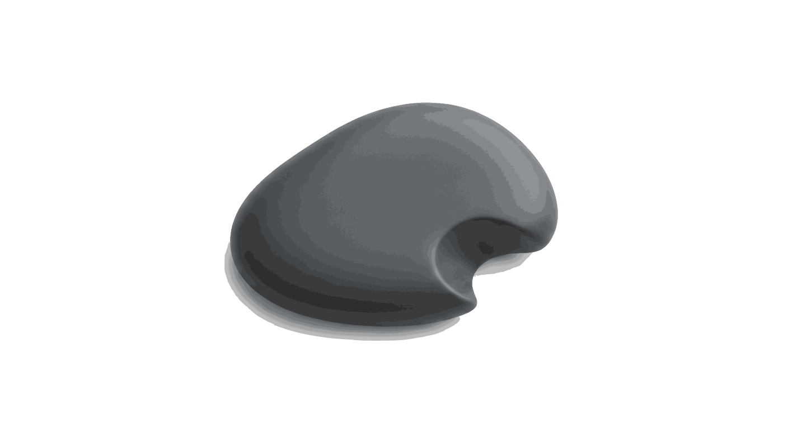

  

  
  
  
  
  

---

**KOZO** is a new kind of operating system—purpose‑built for people who want their computers to feel fast, private, and trustworthy. By pairing the precision of Zig with the safety of Rust, it creates an environment that’s secure from the moment you turn it on, without slowing you down or locking you into a walled garden.

Instead of patching over decades of legacy design, KOZO starts fresh. Its microkernel foundation is clean, modern, and engineered for today’s hardware and expectations, giving you a system that feels lighter, safer, and more dependable from the inside out.

---

Current Status: “KOZO executes a function-call trap path: Rust extern call → asm bridge → Odin dispatcher. This is not a hardware `syscall`/interrupt path and does not perform a privilege transition.”
The current tree exercises the assembly bridge boundary in source and verification, while the kernel bootstrap self-check remains a direct internal dispatcher call.

### Verification Artifacts

Artifacts in `/artifacts` are:
- Reproducible outputs of `scripts/verify.sh`
- NOT authoritative unless `verify.sh` passes on the current tree

Current Status:
- Harness: Active
- Kernel Build: PASS
- Syscall Path: ASM BRIDGE
