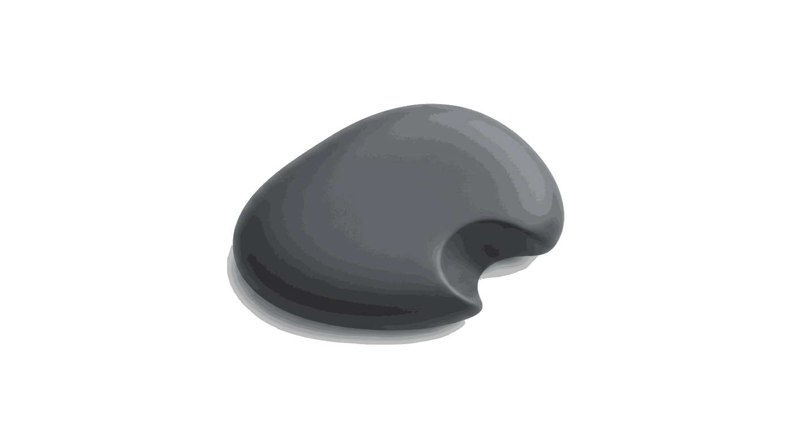

<p align="center">
  <a href="https://kozo.page"></a>
</p>

# KOZO

KOZO is a small operating-system kernel built to make low-level behavior easy
to inspect and verify. It is for people who want to learn how a kernel starts,
crosses CPU privilege levels, handles one fixed request, and proves each step
without hiding the details behind a large system.

Low-level software can fail before normal debugging tools exist. KOZO addresses
that problem by keeping each runtime feature bounded, recording progress over
the serial port, and checking source, kernel-binary, and QEMU evidence against
machine-readable rules.

## What Works Today

KOZO currently boots on the governed x86-64 QEMU path, prepares a controlled
stack and memory region, initializes required CPU math state, activates
KOZO-owned page tables, enters one fixed user-mode probe, completes one fixed
runtime-status request, executes two internal kernel operations, and stops in
a deterministic halt loop.

The accepted run contains 41 ordered progress markers and passes 67 verification
checks. These are narrow proof claims. KOZO does not yet provide general
userspace, processes, a scheduler, a filesystem, Linux or POSIX compatibility,
or production readiness.

## Start Here

1. Read [Why KOZO](docs/wiki/WHY_KOZO.md).
2. Follow [Getting Started](docs/wiki/GETTING_STARTED.md).
3. Use the [User Guide](docs/wiki/USER_GUIDE.md) to understand the result.
4. Open the [wiki index](docs/wiki/README.md) for maintainer and engineering
   paths.

From a configured development environment:

```bash
scripts/build_boot_image.sh
scripts/qemu_smoke.sh
python3 -m unittest discover -s tests
scripts/verify.sh
```

A successful QEMU run ends with `KOZO_RUNTIME_RETURN_OK`. Full verification
writes `artifacts/latest_verify.json` and reports `VERIFY: PASS`.

## Documentation

- [User and maintainer wiki](docs/wiki/README.md)
- [Detailed architecture](docs/ARCHITECTURE.md)
- [Runtime evidence](docs/RUNTIME_EVIDENCE.md)
- [Security boundaries](docs/SECURITY_MODEL.md)
- [Release checklist](docs/RELEASE_CHECKLIST.md)
- [Documentation audit](docs/DOCUMENTATION_AUDIT.md)

User and maintainer guidance starts in `docs/wiki`. Detailed engineering,
contract, security, validation, and historical records remain under `docs`.

## Maintaining KOZO

Read the [Maintainer Guide](docs/wiki/MAINTAINER_GUIDE.md) before changing a
contract, validator, runtime marker, or generated report. Generated files are
review surfaces, not sources of truth, and must be refreshed through their
governed generators.

## License

KOZO is available under the MIT or Apache-2.0 license. See [LICENSE](LICENSE),
[LICENSE-MIT](LICENSE-MIT), and [LICENSE-APACHE](LICENSE-APACHE).
